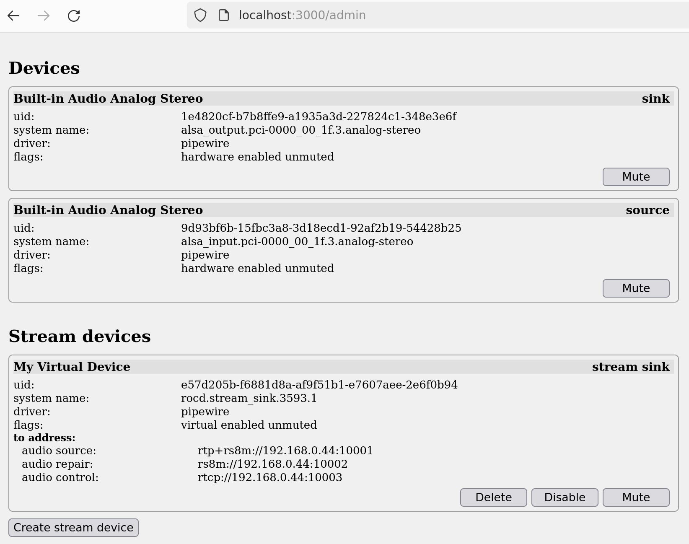

# Usage instructions

<!-- toc -->

- [Command-line flags](#command-line-flags)
- [Configuration file](#configuration-file)
- [Web interface](#web-interface)
- [HTTP API](#http-api)
  * [Devices](#devices)
  * [Streams](#streams)
  * [Stream devices](#stream-devices)
  * [Monitoring](#monitoring)
  * [Swagger](#swagger)

<!-- tocstop -->

## Command-line flags

*TBD*

## Configuration file

*TBD*

## Web interface

Web interface basically allows to do everything that is available via HTTP API. It is primarily intended for developers and administrators.

Web interface is available at `/admin` endpoint. It should be self-explanatory after reading documentation for the HTTP API.



## HTTP API

`rocd` provides several APIs (groups of related endpoints):

| api               | description                                          |
|-------------------|------------------------------------------------------|
| Device API        | Manipulate audio devices                             |
| Stream API        | Manipulate network streams                           |
| Stream device API | Manipulate special virtual devices that do streaming |
| Monitoring API    | Monitor events and logs                              |

The two main abstractions are **device** and **stream** (and **stream device** which is a kind of hybrid of the two). Basically, you can manipulate audio devices and create streams connected to that devices. These is described in more detail below.

For complete API reference, see swagger-generated documentation:

* [specification](https://roc-streaming.org/daemon/swagger.json) ([github](https://github.com/roc-streaming/rocd/blob/main/docs/swagger.json))
* [documentation](https://roc-streaming.org/daemon/)

Note that you can also use swagger specification to automatically generate client code for language of your choice. See details in [official instructions](https://swagger.io/tools/swagger-codegen/).

### Devices

Device represent hardware or virtual audio sink (output device) and source (input device). Devices are present in OS and typically visible to user in sound preferences and apps.

HTTP endpoints to work with devices:

| request                 | description                                |
|-------------------------|--------------------------------------------|
| `GET /devices`          | Show all devices                           |
| `GET /devices/<uid>`    | Show device                                |
| `PUT /devices/<uid>`    | Update device properties                   |

Example sink (output device):

```
{
    "device_uid": "9d033915-4e06b1d9-05272efe-44bd6b60-30496ad8",
    "system_name": "alsa_output.pci-0000_00_1f.3.analog-stereo",
    "display_name": "Built-in Audio Analog Stereo",
    "type": "sink",
    "driver": "pipewire",
    "hardware_device": true,
    "stream_device": false,
    "mute": false
}
```

Example source (input device):

```
{
    "device_uid": "fd4eeb0b-ede57e58-7efd34f2-943703ae-218410b7",
    "system_name": "alsa_input.pci-0000_00_1f.3.analog-stereo",
    "display_name": "Built-in Audio Analog Stereo",
    "type": "source",
    "driver": "pipewire",
    "hardware_device": true,
    "stream_device": false,
    "mute": false
}
```

Device properties:

| property          | can be updated | description                                                                         |
|-------------------|----------------|-------------------------------------------------------------------------------------|
| `device_uid`      | -              | persistent, globally unique identifier used by `rocd`                               |
| `system_name`     | -              | persistent, locally unique identifier used by OS                                    |
| `display_name`    | -              | human-readable, non-unique string presented to user                                 |
| `type`            | -              | device type: `sink`, `source`                                                       |
| `driver`          | -              | device driver: `pipewire`, `pulseaudio`, etc.                                       |
| `hardware_device` | -              | `true` for hardware devices, `false` for virtual devices (including stream devices) |
| `stream_device`   | -              | `true` for stream devices                                                           |
| `mute`            | yes            | `true` if device is muted                                                           |

### Streams

Stream represent active connection between a local device and a remote peer.

**Send stream** captures sound from local source (input device, e.g. microphone) and sends it to remote peer(s). Similarly, **receive stream** receives sound from remote peer(s) and plays it to local sink (output device, e.g. speakers).

HTTP endpoints to work with streams:

| request                 | description              |
|-------------------------|--------------------------|
| `POST /streams`         | Create stream            |
| `DELETE /streams/<uid>` | Remove stream            |
| `GET /streams`          | Show all streams         |
| `GET /streams/<uid>`    | Show stream              |
| `PUT /streams/<uid>`    | Update stream properties |

Example send stream (reads sound from local source):

```
{
    "stream_uid": "bc07f025-09a19c7f-b9cf09c4-8e7cad56-dff73efc",
    "type": "send",
    "from_device": "fd4eeb0b-ede57e58-7efd34f2-943703ae-218410b7",
    "to_address": [
        {
            "audio_source": "rtp+rs8m://192.168.0.1:10001",
            "audio_repair": "rs8m://192.168.0.1:10002",
            "audio_control": "rtcp://192.168.0.1:10003",
        }
    ]
}
```

Example receive stream (writes sound to local sink):

```
{
    "stream_uid": "ce7bbec2-dcc6e819-8b265040-746d90b5-a15834db",
    "type": "recv",
    "to_device": "9d033915-4e06b1d9-05272efe-44bd6b60-30496ad8",
    "from_address": [
        {
            "audio_source": "rtp+rs8m://0.0.0.0:10001",
            "audio_repair": "rs8m://0.0.0.0:10002",
            "audio_control": "rtcp://0.0.0.0:10003",
        }
    ]
}
```

Send stream properties:

| property      | can be updated | description                            |
|---------------|----------------|----------------------------------------|
| `stream_uid`  | -              | globally unique stream identifier      |
| `type`        | -              | stream type: `send`, `recv`            |
| `from_device` | yes            | local input device UID                 |
| `to_address`  | yes            | remote peer URIs where to send packets |

Receive stream properties:

| property       | can be updated | description                               |
|----------------|----------------|-------------------------------------------|
| `stream_uid`   | -              | globally unique stream identifier         |
| `type`         | -              | stream type: `send`, `recv`               |
| `from_address` | yes            | local peer URIs where to receiver packets |
| `to_device`    | yes            | local output device UID                   |

`from_address` and `to_address` should specify the following URIs:

| property        | example                        | description                           |
|-----------------|--------------------------------|---------------------------------------|
| `audio_source`  | `rtp+rs8m://192.168.0.1:10001` | transport address for audio packets   |
| `audio_repair`  | `rs8m://192.168.0.1:10002`     | transport address for repair packets  |
| `audio_control` | `rtcp://192.168.0.1:10003`     | transport address for control packets |

For send stream, `to_address` specifies remote URIs where to connect and send packets. For receiver stream, `from_address` specifies local URIs where to bind and receive packets.

Both `to_address` and `from_address` can have multiple entries if you need to send stream to multiple addresses, or receive stream on multiple addresses, e.g. different network interfaces or protocols.

### Stream devices

Stream device is a special kind of device which, well, combines features of a device and a stream.

Stream devices are useful when you want to create a local virtual device, visible to OS and apps, that represents remote entity. E.g. virtual speakers that streams all sound played to it to remote receiver. Or virtual microphone from which apps can capture stream of remote sender.

Stream devices can have either send or receive streams inside them. Output stream devices have send streams, so that sound played to device by local apps is sent to network. Similarly, input stream devices have receive streams, so that sound received from network can be captured from device by local apps.

All stream devices are still devices, so are accessible via generic `/devices` endpoints together with regular devices.

There are a few additional HTTP endpoints specific to stream devices:

| request                        | description                     |
|--------------------------------|---------------------------------|
| `POST /stream_devices`         | Create stream device            |
| `DELETE /stream_devices/<uid>` | Remove stream device            |
| `GET /stream_devices`          | Show all stream devices         |
| `GET /stream_devices/<uid>`    | Show stream device              |
| `PUT /stream_devices/<uid>`    | Update stream device properties |

Example send stream device (output device):

```
{
    "device_uid": "11a9483e-ba79cbfd-77f691d6-e1b6f3e1-26bbbd6e",
    "system_name": "rocd.send_sink.10",
    "display_name": "Roc Sender",
    "type": "sink",
    "driver": "pipewire",
    "hardware_device": false,
    "stream_device": true,
    "mute": false,
    "to_address": [
        {
            "audio_source": "rtp+rs8m://192.168.0.1:10001",
            "audio_repair": "rs8m://192.168.0.1:10002",
            "audio_control": "rtcp://192.168.0.1:10003",
        }
    ]
}
```

Example receive stream device (input device):

```
{
    "device_uid": "31cc117b-a4e6296b-d2c0bfef-6622dabb-e26950cf",
    "system_name": "rocd.recv_source.12",
    "display_name": "Roc Receiver",
    "type": "source",
    "driver": "pipewire",
    "hardware_device": false,
    "stream_device": true,
    "mute": false,
    "from_address": [
        {
            "audio_source": "rtp+rs8m://0.0.0.0:10001",
            "audio_repair": "rs8m://0.0.0.0:10002",
            "audio_control": "rtcp://0.0.0.0:10003",
        }
    ]
}
```

Stream device properties are the same as device properties, with the addition of `to_address` field for send stream device and `from_address` for receive stream device. The `to_address` and `from_address` fields are the same as for send and receive streams.

### Monitoring

`rocd` also provides endpoints to monitor its state.

HTTP endpoints for monitoring:

| request       | description                         |
|---------------|-------------------------------------|
| `GET /events` | Listen for device and stream events |

Example of reported events:

```
data:{
    "type": "device_added",
    "device_uid": "9d93bf6b-15fbc3a8-3d18ecd1-92af2b19-54428b25"
}

data:{
    "type": "stream_added",
    "stream_uid": "7efa268f-3a91ab7e-38c2b369-27640451-f150144f"
}
```

Events are reported using [Server-sent events](https://developer.mozilla.org/en-US/docs/Web/API/Server-sent_events/Using_server-sent_events) stream (`text/event-stream`). Each SSE message has a single "data" field with a JSON object representing event.

Event properties:

| property     | description                                                                                                        |
|--------------|--------------------------------------------------------------------------------------------------------------------|
| `type`       | event type: `device_added`, `device_changed`, `device_removed`, `stream_added`, `stream_changed`, `stream_removed` |
| `device_uid` | device UID for `device_xxx` events                                                                                 |
| `stream_uid` | stream UID for `stream_xxx` events                                                                                 |

When you start reading `/events`, `rocd` will immediately generate `device_added` and `stream_added` events for all existing devices and streams. This allows to avoid a race when you first get list of devices and streams, and then start reading events, but a new device or stream is added in short time frame between these two actions.

Subsequent events may be squashed, e.g. if device was changed multiple times in a short time frame, you may get only one `device_changed` event; if device was updated and then immediately removed, you may get only one `device_removed` event.

### Swagger

Swagger specification and documentation is available via HTTP API as well:

| request                   | description                                   |
|---------------------------|-----------------------------------------------|
| `GET /swagger/index.html` | Open interactive API documentation in browser |
| `GET /swagger/doc.json`   | Swagger specification in JSON                 |
| `GET /swagger/doc.yaml`   | Swagger specification in YAML                 |
