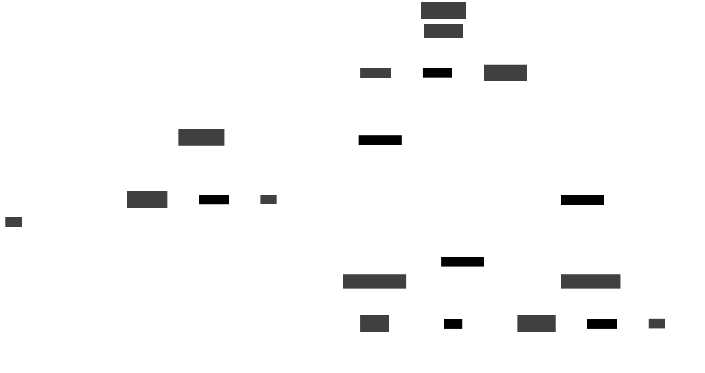

# Relation to Roc Cast

## About Roc Cast

!!! warning

    Roc Cast is still under development. It will gradually evolve from [Roc Droid](https://github.com/roc-streaming/roc-droid).

[Roc Cast](https://github.com/roc-streaming/roc-cast) is an end-user solution for connecting audio apps and devices on a home or office network. 

Although being part of Roc Streaming ecosystem, it is a standalone project, separate from `rocd` and working on top of it. Roc Cast implements custom business logic specific to its use cases, with a user-friendly cross-platform UI.

It comes in two variations:

- native UI for desktop and mobile;
- web UI, suitable for headless systems.

|    Platform | Native UI          | Web UI (HTTP)      |
|------------:|:------------------:|:------------------:|
|          PC | :white_check_mark: | :white_check_mark: |
| Android/iOS | :white_check_mark: | :x:                |
|    Embedded | :x:                | :white_check_mark: |
/// caption
Supported Roc Cast clients for each platform
///

## Interaction with rocd

Roc Cast is implemented as a Flutter application that launches and controls a `rocd` instance on every computer where it runs.

Roc Cast communicates with its local `rocd` instance via REST API, and `rocd` instances communicate with each other via ZeroMQ for signaling and RTP for transport. The transport part is implemented by Roc Toolkit.

On mobile, `rocd` is "embedded" into Roc Cast app via a wrapper library, to gain it access to permissions acquired by the app. However, even though the daemon runs in the same process, Roc Cast still communicates with it via HTTP API the same way as it does on desktop, to keep the codebase uniform across platforms.

!!! note

    Despite that `rocd` has HTTP API and web admin interface, they're not exposed to the user when a `rocd` is controlled by Roc Cast.

This diagram shows example setup where user has three Roc Cast/rocd instances:

- Desktop computer (`roc-cast` launches `rocd` instance and provides native UI).
- Android phone (`roc-cast` embeds `rocd` via a wrapper library and provides native UI).
- Headless Raspberry Pi with Web interface (`roc-cast` launches `rocd` instance and serves a http server with web UI).

All three `rocd` instances discover each other in LAN and communicate via ZMQ and RTP.

/// caption
Example Roc Cast setup
///
